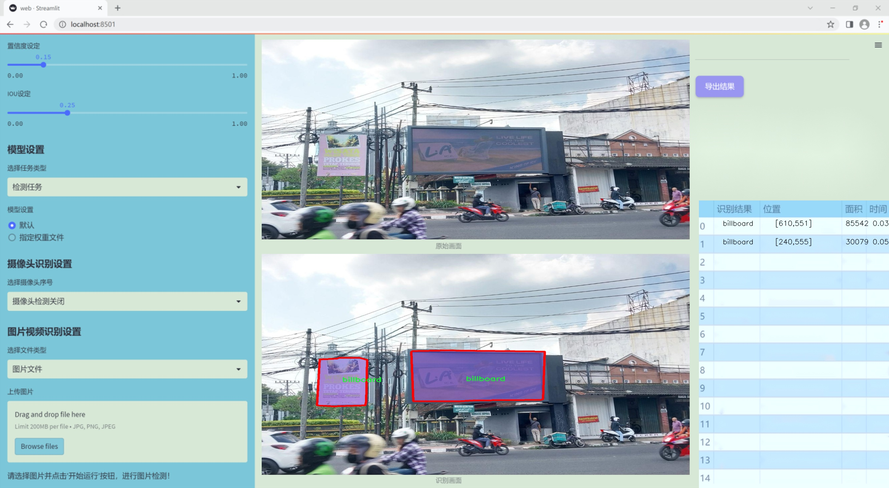
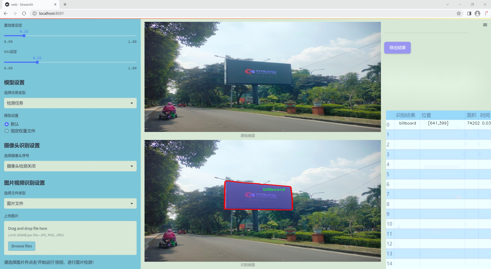
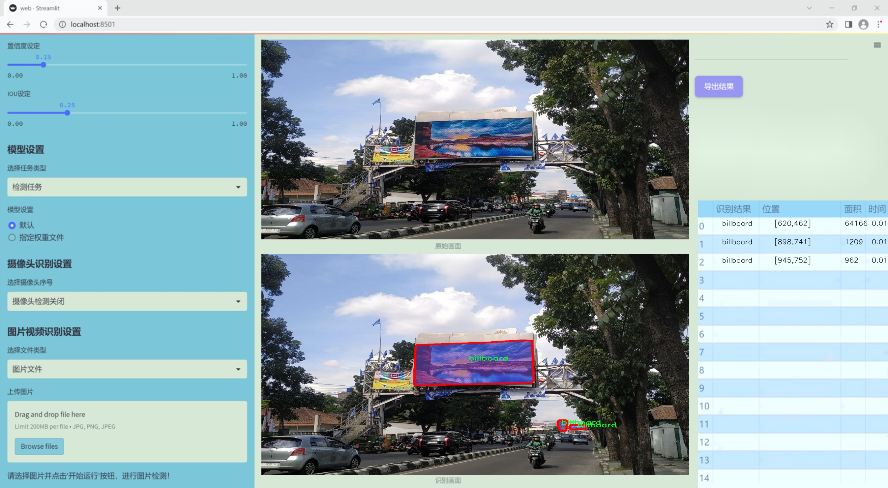
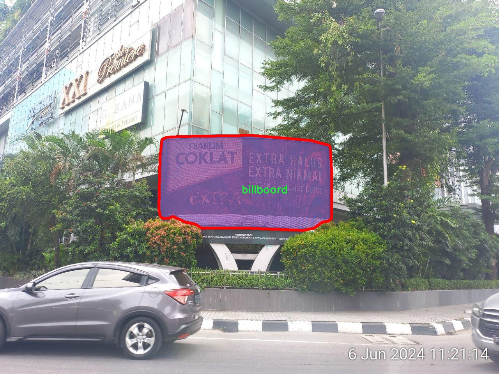
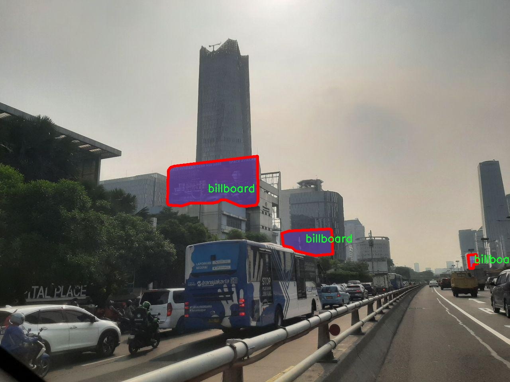
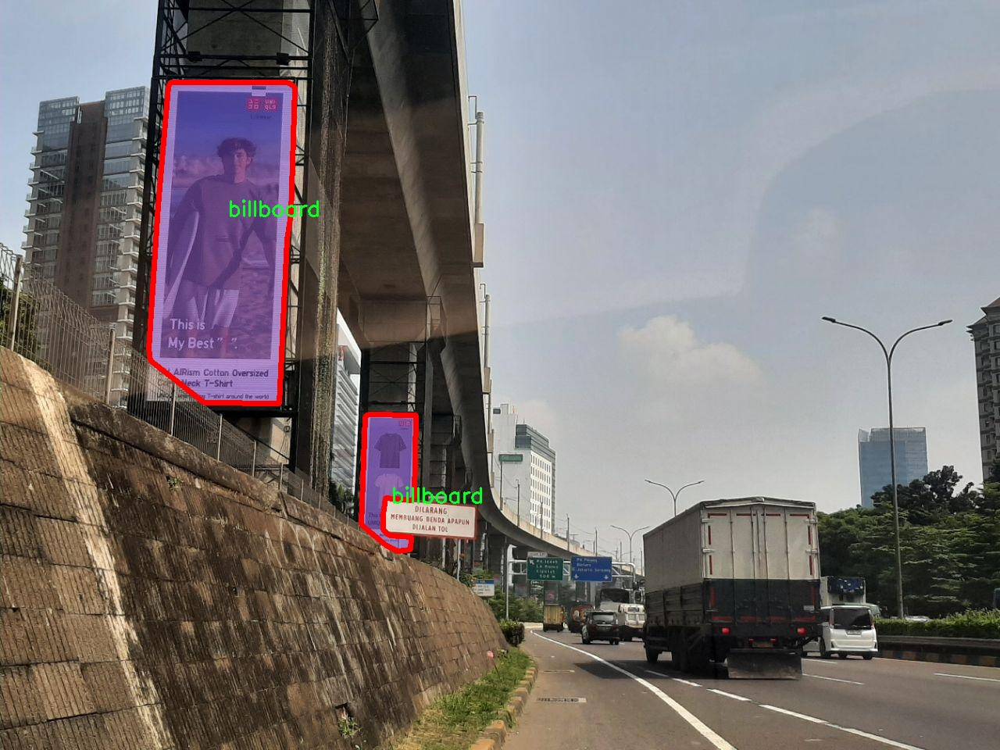
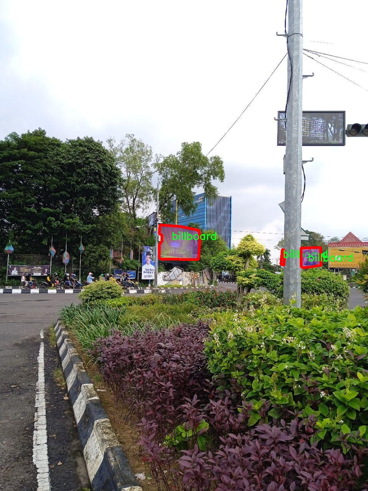
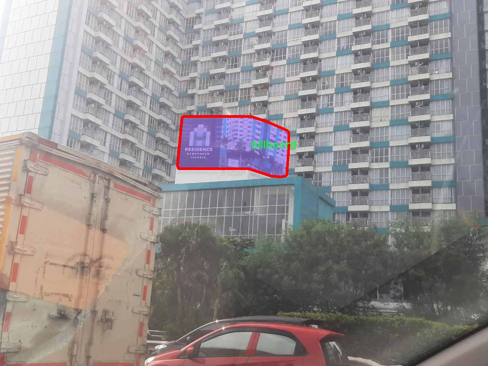

### 1.背景意义

研究背景与意义

随着城市化进程的加快，广告牌作为一种重要的商业宣传媒介，广泛应用于城市的各个角落。广告牌不仅能够有效传达品牌信息，还能吸引路人的注意力，促进消费。然而，随着广告牌数量的增加，如何高效地管理和分析这些广告资源，成为了一个亟待解决的问题。传统的人工监测和管理方式效率低下，且容易出现遗漏和错误。因此，基于计算机视觉技术的广告牌实例分割系统应运而生，旨在通过自动化手段提高广告牌的识别和管理效率。

在这一背景下，YOLO（You Only Look Once）系列模型因其高效的实时检测能力而受到广泛关注。YOLOv11作为该系列的最新版本，进一步提升了检测精度和速度，适用于广告牌的实例分割任务。通过对YOLOv11模型的改进，结合针对广告牌特征的优化策略，可以实现对广告牌的精准定位和分割，为后续的数据分析和管理提供可靠的基础。

本研究基于一个包含2300张广告牌图像的数据集，旨在开发一个高效的广告牌实例分割系统。该数据集专注于单一类别的广告牌，经过精细标注，确保了模型训练的高质量。通过对数据集的深入分析和模型的不断优化，期望能够实现对广告牌的快速识别与分割，进而为广告投放效果评估、城市景观管理等应用提供支持。

总之，基于改进YOLOv11的广告牌实例分割系统不仅具有重要的学术研究价值，还有助于推动广告行业的智能化发展，为城市管理提供新的思路和工具。

### 2.视频效果

[2.1 视频效果](https://www.bilibili.com/video/BV1LfqLYuEzV/)

### 3.图片效果







##### [项目涉及的源码数据来源链接](https://kdocs.cn/l/cszuIiCKVNis)**

注意：本项目提供训练的数据集和训练教程,由于版本持续更新,暂不提供权重文件（best.pt）,请按照6.训练教程进行训练后实现上图演示的效果。

### 4.数据集信息

##### 4.1 本项目数据集类别数＆类别名

nc: 1
names: ['billboard']


该项目为【图像分割】数据集，请在【训练教程和Web端加载模型教程（第三步）】这一步的时候按照【图像分割】部分的教程来训练

##### 4.2 本项目数据集信息介绍

本项目数据集信息介绍

本项目所使用的数据集专注于广告牌的实例分割，旨在为改进YOLOv11模型提供高质量的训练数据。该数据集的主题为“billboard-segmentation”，其设计目标是准确识别和分割图像中的广告牌，以提升计算机视觉系统在城市环境中的应用能力。数据集中包含的类别数量为1，唯一的类别名称为“billboard”，这表明该数据集专注于广告牌的检测与分割任务。

在数据集的构建过程中，收集了多种场景下的广告牌图像，包括城市街道、商业区、交通要道等多样化的环境。这些图像不仅涵盖了不同的光照条件和天气变化，还考虑了广告牌的各种形状、尺寸和风格，以确保模型能够在真实世界中表现出色。每张图像都经过精心标注，确保广告牌的边界框和分割掩码准确无误，为模型训练提供了可靠的基础。

此外，数据集的设计还考虑到了多样性和代表性，确保模型能够适应不同地区和文化背景下的广告牌特征。这种多样性不仅有助于提高模型的泛化能力，还能增强其在实际应用中的鲁棒性。通过使用这一数据集，研究人员希望能够推动广告牌检测技术的发展，最终实现更智能的城市环境监测和广告投放分析。

总之，本项目的数据集为改进YOLOv11的广告牌实例分割系统提供了丰富而高质量的训练数据，旨在提升模型在复杂场景中的表现，推动计算机视觉技术在广告领域的应用。











### 5.全套项目环境部署视频教程（零基础手把手教学）

[5.1 所需软件PyCharm和Anaconda安装教程（第一步）](https://www.bilibili.com/video/BV1BoC1YCEKi/?spm_id_from=333.999.0.0&vd_source=bc9aec86d164b67a7004b996143742dc)


[5.2 安装Python虚拟环境创建和依赖库安装视频教程（第二步）](https://www.bilibili.com/video/BV1ZoC1YCEBw?spm_id_from=333.788.videopod.sections&vd_source=bc9aec86d164b67a7004b996143742dc)

### 6.改进YOLOv11训练教程和Web_UI前端加载模型教程（零基础手把手教学）

[6.1 改进YOLOv11训练教程和Web_UI前端加载模型教程（第三步）](https://www.bilibili.com/video/BV1BoC1YCEhR?spm_id_from=333.788.videopod.sections&vd_source=bc9aec86d164b67a7004b996143742dc)


按照上面的训练视频教程链接加载项目提供的数据集，运行train.py即可开始训练



     Epoch   gpu_mem       box       obj       cls    labels  img_size
     1/200     20.8G   0.01576   0.01955  0.007536        22      1280: 100%|██████████| 849/849 [14:42<00:00,  1.04s/it]
               Class     Images     Labels          P          R     mAP@.5 mAP@.5:.95: 100%|██████████| 213/213 [01:14<00:00,  2.87it/s]
                 all       3395      17314      0.994      0.957      0.0957      0.0843

     Epoch   gpu_mem       box       obj       cls    labels  img_size
     2/200     20.8G   0.01578   0.01923  0.007006        22      1280: 100%|██████████| 849/849 [14:44<00:00,  1.04s/it]
               Class     Images     Labels          P          R     mAP@.5 mAP@.5:.95: 100%|██████████| 213/213 [01:12<00:00,  2.95it/s]
                 all       3395      17314      0.996      0.956      0.0957      0.0845

     Epoch   gpu_mem       box       obj       cls    labels  img_size
     3/200     20.8G   0.01561    0.0191  0.006895        27      1280: 100%|██████████| 849/849 [10:56<00:00,  1.29it/s]
               Class     Images     Labels          P          R     mAP@.5 mAP@.5:.95: 100%|███████   | 187/213 [00:52<00:00,  4.04it/s]
                 all       3395      17314      0.996      0.957      0.0957      0.0845


###### [项目数据集下载链接](https://kdocs.cn/l/cszuIiCKVNis)

### 7.原始YOLOv11算法讲解


##### YOLO11介绍

Ultralytics YOLO11是一款尖端的、最先进的模型，它在之前YOLO版本成功的基础上进行了构建，并引入了新功能和改进，以进一步提升性能和灵活性。
**YOLO11设计快速、准确且易于使用，使其成为各种物体检测和跟踪、实例分割、图像分类以及姿态估计任务的绝佳选择。**


**结构图如下：**


##### **C3k2**

**C3k2，结构图如下**


**C3k2，继承自类`C2f，其中通过c3k设置False或者Ture来决定选择使用C3k还是`**Bottleneck


**实现代码** **ultralytics/nn/modules/block.py**

##### C2PSA介绍

**借鉴V10 PSA结构，实现了C2PSA和C2fPSA，最终选择了基于C2的C2PSA（可能涨点更好？）**


**实现代码** **ultralytics/nn/modules/block.py**

##### Detect介绍

**分类检测头引入了DWConv（更加轻量级，为后续二次创新提供了改进点），结构图如下（和V8的区别）：**


### 8.200+种全套改进YOLOV11创新点原理讲解

#### 8.1 200+种全套改进YOLOV11创新点原理讲解大全

由于篇幅限制，每个创新点的具体原理讲解就不全部展开，具体见下列网址中的改进模块对应项目的技术原理博客网址【Blog】（创新点均为模块化搭建，原理适配YOLOv5~YOLOv11等各种版本）

[改进模块技术原理博客【Blog】网址链接](https://gitee.com/qunmasj/good)


#### 8.2 精选部分改进YOLOV11创新点原理讲解

###### 这里节选部分改进创新点展开原理讲解(完整的改进原理见上图和[改进模块技术原理博客链接](https://gitee.com/qunmasj/good)【如果此小节的图加载失败可以通过CSDN或者Github搜索该博客的标题访问原始博客，原始博客图片显示正常】



### Diverse Branch Block简介
参考该博客提出的一种通用的卷积网络构造块用来在不增加任何推理时间的前提下提升卷积网络的性能。我们将这个块命名为分离分支块（Diverse Branch Block）。通过结合不同尺寸和复杂度的分离分支（包括串联卷积、多尺度卷积和平均池化层）来增加特征空间的方法，它提升了单个卷积的表达能力。完成训练后，一个DBB(Diverse Branch Block)可以被等价地转换为一个单独的卷积操作以方便部署。不同于那些新颖的卷积结构的改进方式，DBB让训练时微结构复杂化同时维持大规模结构，因此我们可以将它作为任意结构中通用卷积层的一种嵌入式替代形式。通过这种方式，我们能够将模型训练到一个更高的表现水平，然后在推理时转换成原始推理时间的结构。

 
主要贡献点：

（1） 我们建议合并大量的微结构到不同的卷积结构中来提升性能，但是维持原始的宏观结构。

（2）我们提出DBB，一个通用构造块结构，概括六种转换来将一个DBB结构转化成一个单独卷积，因为对于用户来说它是无损的。

（3）我们提出一个Inception-like DBB结构实例(Fig 1)，并且展示它在ImageNet、COCO detection 和CityScapes任务中获得性能提升。


#### 结构重参数化
本文和一个并发网络RepVGG[1]是第一个使用结构重参数化来命名该思路------使用从其他结构转化来的参数确定当前结构的参数。一个之前的工作ACNet[2]也可以被划分为结构重参数化，它提出使用非对称卷积块来增强卷积核的结构（i.e 十字形结构）。相比于DBB，它被设计来提升卷积网络（在没有额外推理时间损失的条件下）。这个流水线也包含将一个训练好的模型转化为另一个。但是，ACNet和DBB的区别是：ACNet的思想被激发是基于一个观察，这个观察是网络结构的参数在过去有更大的量级，因此寻找方法让参数量级更大，然而我们关注一个不同的点。我们发现 平均池化、1x1 conv 和 1x1-kxk串联卷积是更有效的，因为它们提供了不同复杂度的路线，以及允许使用更多训练时非线性化。除此以外，ACB结构可以看作是DBB结构的一种特殊形式，因为那个1xk和kx1卷积层能够被扩大成kxk（via Transform VI(Fig.2)），然后合并成一个平方核（via Transform II）。

 

#### 分离分支结构
卷积的线性性
一个卷积操作可以表示为 ，其中为输入tensor, 为输出tensor。卷积核表示为一个四阶tensor , 偏置为。将加偏置的操作表示为。

因为，在第j个输出通道（h,w）位置的值可以由以下公式给出：，其中表示输入帧I的第c个通道上的一个滑动窗，对应输出帧O的坐标（h,w）。从上式可以看出，卷积操作具有齐次性和加法性。


注意：加法性成立的条件是两个卷积具有相同的配置（即通道数、核尺寸、步长和padding等）。

#### 分离分支的卷积
在这一小节，我们概括六种转换形式（Fig.2）来转换一个具有batch normalization(BN)、branch addition、depth concatenation、multi-scale operations、avarage pooling 和 sequences of convolutions的DBB分支。


Transform I：a conv for conv-BN  我们通常会给一个卷积配备配备一个BN层，它执行逐通道正则化和线性尺度放缩。设j为通道索引，分别为累积的逐通道均值和标准差，分别为学习的尺度因子和偏置项，对应输出通道j为


卷积的齐次性允许我们融合BN操作到前述的conv来做推理。在实践中，我们仅仅建立一个拥有卷积核和偏置, 用从原始BN序列的参数转换来的值来赋值。我们为每个输出通道j构造


Transform II a conv for branch addition  卷积的加法性确保如果有两个或者多个具有相同配置的卷积层相加，我们能够将它们合并到一个单独的卷积里面。对于conv-BN，我们应该首先执行Transform I。很明显的，通过下面的公式我们能够合并两个卷积


上述公式只有在两个卷积拥有相同配置时才成立。尽管合并上述分支能够在一定程度上增强模型，我们希望结合不同分支来进一步提升模型性能。在后面，我们介绍一些分支的形式，它们能够等价地被转化为一个单独的卷积。在通过多个转化来为每一个分支构造KxK的卷积之后，我们使用Transform II 将所有分支合并到一个conv里面。

Transform III: a conv for sequential convolutions   我们能够合并一个1x1 conv-BN-kxk conv序列到一个kxk conv里面。我们暂时假设卷积是稠密的（即 组数 groups=1）。组数groups>1的情形将会在Transform IV中实现。我们假定1x1和kxk卷积层的核形状分别是DxCx1x1和ExDxKxK，这里D指任意值。首先，我们将两个BN层融合到两个卷积层里面，由此获得。输出是


我们期望用一个单独卷积的核和偏置来表达，设, 它们满足。对方程（8）应用卷积的加法性，我们有


因为是一个1x1 conv，它只执行逐通道线性组合，没有空间聚合操作。通过线性重组KxK卷积核中的参数，我们能够将它合并到一个KxK的卷积核里面。容易证明的是，这样的转换可以由一个转置卷积实现：


其中是由转置获得的tensor张量。方程（10）的第二项是作用于常量矩阵上的卷积操作，因此它的输出也是一个常量矩阵。用表达式来说明，设是一个常数矩阵，其中的每个元素都等于p。*是一个2D 卷积操作，W为一个2D 卷积核。转换结果就是一个常量矩阵，这个常量矩阵是p 与 所有核元素之和 的乘积，即


基于以上观察，我们构造。然后，容易证明。

因此我们有

显而易见地，对于一个zero-pads 的KxK卷积，方程（8）并不成立，因为并不对的结果做卷积操作(如果有一个零元素的额外的圈，方程（8）成立)。解决方案有A)用padding配置第一个卷积，第二个卷积不用，B)通过做pad操作。后者的一个有效实现是定制第一个BN层，为了（1）如通常的batch-normalize输入。（2）计算(通过方程（6）)。（3）用  pad batch-normalized结果，例如 用一圈 pad 每一个通道j 。

Transform IV: a conv for depth concatenation  Inception 单元使用深度concatenation来组合不同分支。当每个分支都只包含一个相同配置的卷积时，深度concatenation等价于一个卷积，它的核在不同的输出通道上concatenation（比如我们公式中的第一个轴）假设。我们concatenate它们到。显然地


Transform IV 可以非常方便地将Transform III 扩展到 groupwise（即 groups > 1） 的情景。直觉上，一个groupwise 卷积将输入分割成g个并行的组，单独卷积它们，然后concatenate形成输出。为了代替g-group卷积，我们建立一个DBB结构，这个结构的所有卷积层有相同的组g。为了转换一个1x1-KxK序列，我们等价地分割它们成为g组，单独执行Transform III, 然后concatenate获得输出（如图Fig3所示）。


Transform V: a conv for average pooling  一个作用于C通道的核尺寸为K，步长为s的平均池化层等价于一个拥有相同核尺寸K,步长s的卷积层。这样的核可以被构造为

  


就像一个通常的平均池化操作，当s>1时执行降采样操作，当s=1时保持相同尺寸。

Transform VI: a conv for multi-scale convolutions   考虑一个等价于一个拥有相同zero padding的 核。特别地，卷积是格外实用的，因为它们能够有效实现。应该对输入作pad操作来对齐滑动窗。


### 9.系统功能展示

图9.1.系统支持检测结果表格显示

  图9.2.系统支持置信度和IOU阈值手动调节

  图9.3.系统支持自定义加载权重文件best.pt(需要你通过步骤5中训练获得)

  图9.4.系统支持摄像头实时识别

  图9.5.系统支持图片识别

  图9.6.系统支持视频识别

  图9.7.系统支持识别结果文件自动保存

  图9.8.系统支持Excel导出检测结果数据


### 10. YOLOv11核心改进源码讲解

#### 10.1 hcfnet.py

以下是对代码中最核心部分的分析和详细注释。我们将保留关键的模块和类，并对其功能进行解释。

```python
import math
import torch
import torch.nn as nn
import torch.nn.functional as F

# 定义空间注意力模块
class SpatialAttentionModule(nn.Module):
    def __init__(self):
        super(SpatialAttentionModule, self).__init__()
        # 2通道输入，1通道输出的卷积层
        self.conv2d = nn.Conv2d(in_channels=2, out_channels=1, kernel_size=7, stride=1, padding=3)
        self.sigmoid = nn.Sigmoid()  # Sigmoid激活函数

    def forward(self, x):
        # 计算输入x的平均值和最大值
        avgout = torch.mean(x, dim=1, keepdim=True)  # 平均池化
        maxout, _ = torch.max(x, dim=1, keepdim=True)  # 最大池化
        out = torch.cat([avgout, maxout], dim=1)  # 拼接平均和最大值
        out = self.sigmoid(self.conv2d(out))  # 通过卷积和Sigmoid激活
        return out * x  # 返回加权后的输入

# 定义局部全局注意力模块
class LocalGlobalAttention(nn.Module):
    def __init__(self, output_dim, patch_size):
        super().__init__()
        self.output_dim = output_dim
        self.patch_size = patch_size
        self.mlp1 = nn.Linear(patch_size * patch_size, output_dim // 2)  # MLP层
        self.norm = nn.LayerNorm(output_dim // 2)  # 层归一化
        self.mlp2 = nn.Linear(output_dim // 2, output_dim)  # MLP层
        self.conv = nn.Conv2d(output_dim, output_dim, kernel_size=1)  # 1x1卷积
        self.prompt = torch.nn.parameter.Parameter(torch.randn(output_dim, requires_grad=True))  # 可学习的参数
        self.top_down_transform = torch.nn.parameter.Parameter(torch.eye(output_dim), requires_grad=True)  # 变换矩阵

    def forward(self, x):
        x = x.permute(0, 2, 3, 1)  # 调整维度顺序
        B, H, W, C = x.shape  # 获取批量大小、高度、宽度和通道数
        P = self.patch_size

        # 局部分支
        local_patches = x.unfold(1, P, P).unfold(2, P, P)  # 获取局部补丁
        local_patches = local_patches.reshape(B, -1, P * P, C)  # 重塑形状
        local_patches = local_patches.mean(dim=-1)  # 计算补丁的平均值

        local_patches = self.mlp1(local_patches)  # 通过MLP
        local_patches = self.norm(local_patches)  # 归一化
        local_patches = self.mlp2(local_patches)  # 通过MLP

        local_attention = F.softmax(local_patches, dim=-1)  # 计算注意力权重
        local_out = local_patches * local_attention  # 加权输出

        # 计算余弦相似度并应用掩码
        cos_sim = F.normalize(local_out, dim=-1) @ F.normalize(self.prompt[None, ..., None], dim=1)
        mask = cos_sim.clamp(0, 1)
        local_out = local_out * mask
        local_out = local_out @ self.top_down_transform  # 应用变换

        # 恢复形状并上采样
        local_out = local_out.reshape(B, H // P, W // P, self.output_dim)
        local_out = local_out.permute(0, 3, 1, 2)  # 调整维度顺序
        local_out = F.interpolate(local_out, size=(H, W), mode='bilinear', align_corners=False)  # 上采样
        output = self.conv(local_out)  # 通过1x1卷积

        return output

# 定义PPA模块
class PPA(nn.Module):
    def __init__(self, in_features, filters) -> None:
        super().__init__()
        self.skip = nn.Conv2d(in_features, filters, kernel_size=1)  # 跳跃连接
        self.c1 = nn.Conv2d(filters, filters, kernel_size=3, padding=1)  # 卷积层
        self.c2 = nn.Conv2d(filters, filters, kernel_size=3, padding=1)  # 卷积层
        self.c3 = nn.Conv2d(filters, filters, kernel_size=3, padding=1)  # 卷积层
        self.sa = SpatialAttentionModule()  # 空间注意力模块
        self.lga2 = LocalGlobalAttention(filters, 2)  # 局部全局注意力模块
        self.lga4 = LocalGlobalAttention(filters, 4)  # 局部全局注意力模块
        self.drop = nn.Dropout2d(0.1)  # Dropout层
        self.bn1 = nn.BatchNorm2d(filters)  # 批归一化
        self.silu = nn.SiLU()  # SiLU激活函数

    def forward(self, x):
        x_skip = self.skip(x)  # 跳跃连接
        x_lga2 = self.lga2(x_skip)  # 局部全局注意力
        x_lga4 = self.lga4(x_skip)  # 局部全局注意力
        x1 = self.c1(x)  # 第一层卷积
        x2 = self.c2(x1)  # 第二层卷积
        x3 = self.c3(x2)  # 第三层卷积
        # 将所有输出相加
        x = x1 + x2 + x3 + x_skip + x_lga2 + x_lga4
        x = self.bn1(x)  # 批归一化
        x = self.sa(x)  # 空间注意力
        x = self.drop(x)  # Dropout
        x = self.silu(x)  # SiLU激活
        return x

# 定义DASI模块
class DASI(nn.Module):
    def __init__(self, in_features, out_features) -> None:
        super().__init__()
        self.tail_conv = nn.Conv2d(out_features, out_features, kernel_size=1)  # 尾部卷积
        self.conv = nn.Conv2d(out_features // 2, out_features // 4, kernel_size=1)  # 卷积层
        self.bns = nn.BatchNorm2d(out_features)  # 批归一化
        self.skips = nn.Conv2d(in_features[1], out_features, kernel_size=1)  # 跳跃连接
        self.skips_2 = nn.Conv2d(in_features[0], out_features, kernel_size=1)  # 跳跃连接
        self.skips_3 = nn.Conv2d(in_features[2], out_features, kernel_size=3, stride=2, dilation=2, padding=2)  # 跳跃连接
        self.silu = nn.SiLU()  # SiLU激活函数

    def forward(self, x_list):
        x_low, x, x_high = x_list  # 解包输入
        x_high = self.skips_3(x_high) if x_high is not None else None  # 跳跃连接
        x_low = self.skips_2(x_low) if x_low is not None else None  # 跳跃连接
        x = self.skips(x)  # 跳跃连接
        x_skip = x  # 保存跳跃连接的输出
        x = torch.chunk(x, 4, dim=1)  # 将x分成4个部分

        # 根据高低特征的存在与否进行不同的处理
        if x_high is None:
            x0 = self.conv(torch.cat((x[0], x_low[0]), dim=1))
            x1 = self.conv(torch.cat((x[1], x_low[1]), dim=1))
            x2 = self.conv(torch.cat((x[2], x_low[2]), dim=1))
            x3 = self.conv(torch.cat((x[3], x_low[3]), dim=1))
        elif x_low is None:
            x0 = self.conv(torch.cat((x[0], x_high[0]), dim=1))
            x1 = self.conv(torch.cat((x[1], x_high[1]), dim=1))
            x2 = self.conv(torch.cat((x[2], x_high[2]), dim=1))
            x3 = self.conv(torch.cat((x[3], x_high[3]), dim=1))
        else:
            x0 = self.bag(x_low[0], x_high[0], x[0])
            x1 = self.bag(x_low[1], x_high[1], x[1])
            x2 = self.bag(x_low[2], x_high[2], x[2])
            x3 = self.bag(x_low[3], x_high[3], x[3])

        x = torch.cat((x0, x1, x2, x3), dim=1)  # 合并输出
        x = self.tail_conv(x)  # 尾部卷积
        x += x_skip  # 添加跳跃连接
        x = self.bns(x)  # 批归一化
        x = self.silu(x)  # SiLU激活
        return x
```

### 代码核心部分分析
1. **SpatialAttentionModule**: 该模块通过计算输入特征图的平均值和最大值，生成一个空间注意力图，进而对输入进行加权，以增强重要特征。

2. **LocalGlobalAttention**: 该模块结合局部和全局信息，通过MLP和注意力机制来处理输入特征图，旨在提取更丰富的特征表示。

3. **PPA**: 该模块整合了多个卷积层、空间注意力和局部全局注意力模块，旨在通过多层次特征融合来提升模型的表现。

4. **DASI**: 该模块通过不同尺度的特征融合和跳跃连接，结合了高、低层特征，增强了模型的表达能力。

这些模块的设计和实现旨在提升深度学习模型在图像处理等任务中的性能，利用注意力机制和特征融合技术来增强特征表示。

这个文件 `hcfnet.py` 实现了一个深度学习模型的多个模块，主要用于图像处理任务。文件中定义了几个类，包括空间注意力模块、局部全局注意力模块、ECA（Efficient Channel Attention）模块、PPA（Patch Processing Attention）模块和DASI（Dual Attention Spatial Interaction）模块。

首先，`SpatialAttentionModule` 类实现了一个空间注意力机制。它通过计算输入特征图的平均值和最大值来生成两个特征图，然后将它们拼接在一起，经过一个卷积层和Sigmoid激活函数，最终生成一个注意力权重图。这一权重图与输入特征图相乘，以突出重要的空间信息。

接下来，`LocalGlobalAttention` 类实现了局部和全局注意力机制。它首先将输入特征图分割成小块，然后对每个小块进行处理，通过多层感知机（MLP）进行特征提取，并使用层归一化进行标准化。随后，计算每个小块的注意力权重，并与局部特征进行加权结合。最终，经过一个卷积层，输出特征图。

`ECA` 类实现了一种高效的通道注意力机制。它通过自适应平均池化将输入特征图压缩为一个通道描述符，然后使用一维卷积和Sigmoid激活函数生成通道注意力权重。这个权重与输入特征图相乘，以增强重要通道的特征。

`PPA` 类结合了前面提到的模块，构建了一个复杂的特征提取网络。它使用卷积层、空间注意力模块和局部全局注意力模块来处理输入特征图，并通过跳跃连接（skip connection）将不同层的特征结合在一起。最后，经过批归一化和激活函数处理，输出最终特征图。

`Bag` 类是一个简单的模块，用于结合来自不同来源的特征。它通过计算边缘注意力权重来加权输入特征，并生成融合后的特征图。

最后，`DASI` 类实现了一个更复杂的注意力机制，结合了来自不同层的特征。它使用多个卷积层和跳跃连接来处理输入特征，并在融合特征时使用 `Bag` 类来增强特征的表达能力。最终，经过卷积和批归一化处理，输出特征图。

整体来看，这个文件实现了一个基于注意力机制的深度学习模型，旨在通过不同的模块和层次结构来提高图像特征的提取和表示能力。

#### 10.2 kagn_conv.py

以下是经过简化和注释的核心代码部分：

```python
import torch
import torch.nn as nn
from functools import lru_cache

class KAGNConvNDLayer(nn.Module):
    def __init__(self, conv_class, norm_class, conv_w_fun, input_dim, output_dim, degree, kernel_size,
                 groups=1, padding=0, stride=1, dilation=1, dropout: float = 0.0, ndim: int = 2):
        super(KAGNConvNDLayer, self).__init__()
        
        # 初始化参数
        self.inputdim = input_dim  # 输入维度
        self.outdim = output_dim    # 输出维度
        self.degree = degree         # 多项式的阶数
        self.kernel_size = kernel_size  # 卷积核大小
        self.padding = padding       # 填充
        self.stride = stride         # 步幅
        self.dilation = dilation     # 膨胀
        self.groups = groups         # 分组卷积的组数
        self.base_activation = nn.SiLU()  # 基础激活函数
        self.conv_w_fun = conv_w_fun  # 卷积权重函数
        self.ndim = ndim             # 数据的维度
        self.dropout = nn.Dropout2d(p=dropout) if dropout > 0 and ndim == 2 else None  # Dropout层

        # 参数检查
        if groups <= 0:
            raise ValueError('groups must be a positive integer')
        if input_dim % groups != 0:
            raise ValueError('input_dim must be divisible by groups')
        if output_dim % groups != 0:
            raise ValueError('output_dim must be divisible by groups')

        # 创建基础卷积层和归一化层
        self.base_conv = nn.ModuleList([conv_class(input_dim // groups,
                                                   output_dim // groups,
                                                   kernel_size,
                                                   stride,
                                                   padding,
                                                   dilation,
                                                   groups=1,
                                                   bias=False) for _ in range(groups)])

        self.layer_norm = nn.ModuleList([norm_class(output_dim // groups) for _ in range(groups)])

        # 多项式权重参数
        poly_shape = (groups, output_dim // groups, (input_dim // groups) * (degree + 1)) + tuple(
            kernel_size for _ in range(ndim))
        self.poly_weights = nn.Parameter(torch.randn(*poly_shape))  # 多项式权重
        self.beta_weights = nn.Parameter(torch.zeros(degree + 1, dtype=torch.float32))  # beta权重

        # 权重初始化
        for conv_layer in self.base_conv:
            nn.init.kaiming_uniform_(conv_layer.weight, nonlinearity='linear')
        nn.init.kaiming_uniform_(self.poly_weights, nonlinearity='linear')
        nn.init.normal_(
            self.beta_weights,
            mean=0.0,
            std=1.0 / ((kernel_size ** ndim) * self.inputdim * (self.degree + 1.0)),
        )

    def beta(self, n, m):
        # 计算beta值
        return (
            ((m + n) * (m - n) * n ** 2) / (m ** 2 / (4.0 * n ** 2 - 1.0))
        ) * self.beta_weights[n]

    @lru_cache(maxsize=128)  # 使用缓存避免重复计算
    def gram_poly(self, x, degree):
        # 计算Gram多项式
        p0 = x.new_ones(x.size())  # p0初始化为1
        if degree == 0:
            return p0.unsqueeze(-1)

        p1 = x
        grams_basis = [p0, p1]

        for i in range(2, degree + 1):
            p2 = x * p1 - self.beta(i - 1, i) * p0  # 递归计算多项式
            grams_basis.append(p2)
            p0, p1 = p1, p2

        return torch.cat(grams_basis, dim=1)  # 合并多项式基

    def forward_kag(self, x, group_index):
        # 前向传播过程
        basis = self.base_conv[group_index](self.base_activation(x))  # 基础卷积
        x = torch.tanh(x).contiguous()  # 归一化输入
        if self.dropout is not None:
            x = self.dropout(x)  # 应用Dropout

        grams_basis = self.base_activation(self.gram_poly(x, self.degree))  # 计算Gram多项式基
        y = self.conv_w_fun(grams_basis, self.poly_weights[group_index],
                            stride=self.stride, dilation=self.dilation,
                            padding=self.padding, groups=1)  # 卷积操作

        y = self.base_activation(self.layer_norm[group_index](y + basis))  # 归一化和激活
        return y

    def forward(self, x):
        # 整体前向传播
        split_x = torch.split(x, self.inputdim // self.groups, dim=1)  # 按组分割输入
        output = []
        for group_ind, _x in enumerate(split_x):
            y = self.forward_kag(_x.clone(), group_ind)  # 对每组进行前向传播
            output.append(y.clone())
        y = torch.cat(output, dim=1)  # 合并输出
        return y
```

### 代码说明：
1. **KAGNConvNDLayer类**：这是一个自定义的卷积层，支持多维卷积（1D、2D、3D），实现了基于Gram多项式的卷积操作。
2. **初始化方法**：初始化卷积层、归一化层和多项式权重，并进行必要的参数检查和权重初始化。
3. **beta方法**：计算用于Gram多项式的beta值。
4. **gram_poly方法**：计算Gram多项式的基，使用递归关系生成多项式。
5. **forward_kag方法**：实现了单组的前向传播，包括基础卷积、Gram多项式计算和归一化。
6. **forward方法**：对输入进行分组处理，并对每组调用`forward_kag`进行前向传播，最后合并输出。

这个程序文件 `kagn_conv.py` 定义了一系列用于卷积神经网络的层，主要是基于 KAGN（Kochawongwat 的一种新型卷积方法）模型。文件中包含了一个基类 `KAGNConvNDLayer` 和三个子类 `KAGNConv3DLayer`、`KAGNConv2DLayer` 和 `KAGNConv1DLayer`，分别用于处理三维、二维和一维卷积。

在 `KAGNConvNDLayer` 类的构造函数中，首先初始化了一些卷积层所需的参数，如输入维度、输出维度、卷积核大小、步幅、填充、扩张、分组数等。该类使用了 `nn.ModuleList` 来创建多个卷积层和归一化层，以支持分组卷积。这里的 `conv_class` 和 `norm_class` 分别代表卷积层和归一化层的类型，允许用户根据需要自定义。

此外，类中还定义了多项式权重和 beta 权重，并使用 Kaiming 均匀分布初始化这些权重，以提高训练的稳定性和效率。`beta` 方法用于计算与 Legendre 多项式相关的权重，而 `gram_poly` 方法则计算给定阶数的 Legendre 多项式。

在 `forward_kag` 方法中，首先对输入进行基础激活，然后进行线性变换。接着，输入被归一化到 [-1, 1] 的范围，以便进行稳定的 Legendre 多项式计算。之后，通过 `gram_poly` 方法生成 Gram 基，并利用自定义的卷积函数进行卷积操作，最后经过归一化和激活函数处理后返回结果。

`forward` 方法则是对输入进行分组处理，并对每个组调用 `forward_kag` 方法，最终将所有组的输出拼接在一起返回。

三个子类 `KAGNConv3DLayer`、`KAGNConv2DLayer` 和 `KAGNConv1DLayer` 继承自 `KAGNConvNDLayer`，并在初始化时指定相应的卷积和归一化层类型，以便于在不同维度上使用 KAGN 卷积层。

整体来看，这个文件实现了一个灵活且高效的卷积层结构，能够处理不同维度的输入，并通过引入 Legendre 多项式来增强模型的表达能力。

#### 10.3 efficientViT.py

以下是代码中最核心的部分，并附上详细的中文注释：

```python
import torch
import torch.nn as nn
import torch.nn.functional as F
import itertools

class Conv2d_BN(torch.nn.Sequential):
    """ 
    带有批归一化的卷积层
    """
    def __init__(self, in_channels, out_channels, kernel_size=1, stride=1, padding=0, dilation=1,
                 groups=1, bn_weight_init=1):
        super().__init__()
        # 添加卷积层
        self.add_module('c', torch.nn.Conv2d(
            in_channels, out_channels, kernel_size, stride, padding, dilation, groups, bias=False))
        # 添加批归一化层
        self.add_module('bn', torch.nn.BatchNorm2d(out_channels))
        # 初始化批归一化的权重
        torch.nn.init.constant_(self.bn.weight, bn_weight_init)
        torch.nn.init.constant_(self.bn.bias, 0)

    @torch.no_grad()
    def switch_to_deploy(self):
        """
        将模型切换到推理模式，合并卷积和批归一化层
        """
        c, bn = self._modules.values()
        # 计算新的卷积权重和偏置
        w = bn.weight / (bn.running_var + bn.eps)**0.5
        w = c.weight * w[:, None, None, None]
        b = bn.bias - bn.running_mean * bn.weight / (bn.running_var + bn.eps)**0.5
        # 创建新的卷积层
        m = torch.nn.Conv2d(w.size(1) * self.c.groups, w.size(0), w.shape[2:], stride=self.c.stride, padding=self.c.padding, dilation=self.c.dilation, groups=self.c.groups)
        m.weight.data.copy_(w)
        m.bias.data.copy_(b)
        return m

class EfficientViTBlock(torch.nn.Module):
    """ 
    EfficientViT的基本构建块
    """
    def __init__(self, type, ed, kd, nh=8, ar=4, resolution=14, window_resolution=7):
        super().__init__()
        # 深度卷积和残差连接
        self.dw0 = Residual(Conv2d_BN(ed, ed, 3, 1, 1, groups=ed, bn_weight_init=0.))
        self.ffn0 = Residual(FFN(ed, int(ed * 2)))

        if type == 's':
            # 使用局部窗口注意力
            self.mixer = Residual(LocalWindowAttention(ed, kd, nh, attn_ratio=ar, resolution=resolution, window_resolution=window_resolution))

        self.dw1 = Residual(Conv2d_BN(ed, ed, 3, 1, 1, groups=ed, bn_weight_init=0.))
        self.ffn1 = Residual(FFN(ed, int(ed * 2)))

    def forward(self, x):
        # 前向传播
        return self.ffn1(self.dw1(self.mixer(self.ffn0(self.dw0(x)))))


class EfficientViT(torch.nn.Module):
    """ 
    EfficientViT模型
    """
    def __init__(self, img_size=400, patch_size=16, in_chans=3, stages=['s', 's', 's'],
                 embed_dim=[64, 128, 192], key_dim=[16, 16, 16], depth=[1, 2, 3], num_heads=[4, 4, 4]):
        super().__init__()

        # 图像嵌入层
        self.patch_embed = torch.nn.Sequential(
            Conv2d_BN(in_chans, embed_dim[0] // 8, 3, 2, 1),
            torch.nn.ReLU(),
            Conv2d_BN(embed_dim[0] // 8, embed_dim[0] // 4, 3, 2, 1),
            torch.nn.ReLU(),
            Conv2d_BN(embed_dim[0] // 4, embed_dim[0] // 2, 3, 2, 1),
            torch.nn.ReLU(),
            Conv2d_BN(embed_dim[0] // 2, embed_dim[0], 3, 1, 1)
        )

        # 构建各个阶段的块
        self.blocks1 = []
        self.blocks2 = []
        self.blocks3 = []
        for i, (stg, ed, kd, dpth, nh) in enumerate(zip(stages, embed_dim, key_dim, depth, num_heads)):
            for d in range(dpth):
                eval('self.blocks' + str(i + 1)).append(EfficientViTBlock(stg, ed, kd, nh))
        
        self.blocks1 = torch.nn.Sequential(*self.blocks1)
        self.blocks2 = torch.nn.Sequential(*self.blocks2)
        self.blocks3 = torch.nn.Sequential(*self.blocks3)

    def forward(self, x):
        # 前向传播
        outs = []
        x = self.patch_embed(x)
        x = self.blocks1(x)
        outs.append(x)
        x = self.blocks2(x)
        outs.append(x)
        x = self.blocks3(x)
        outs.append(x)
        return outs

# 创建模型实例
if __name__ == '__main__':
    model = EfficientViT(img_size=224)
    inputs = torch.randn((1, 3, 640, 640))
    res = model(inputs)
    for i in res:
        print(i.size())
```

### 代码说明：
1. **Conv2d_BN**：定义了一个带有批归一化的卷积层，提供了一个方法用于将卷积和批归一化合并为一个卷积层以提高推理效率。
2. **EfficientViTBlock**：构建了EfficientViT的基本构建块，包含深度卷积、前馈网络和局部窗口注意力机制。
3. **EfficientViT**：整体模型的定义，包含图像嵌入层和多个构建块的组合，支持多种参数配置。
4. **前向传播**：在`EfficientViT`类中实现，逐层处理输入数据并返回多个输出。

这个程序文件 `efficientViT.py` 实现了一个高效的视觉变换器（Efficient Vision Transformer）模型架构，主要用于下游任务的图像处理。代码中包含了多个类和函数，构成了整个模型的结构。

首先，文件导入了必要的库，包括 PyTorch 及其相关模块，以及用于实现 Squeeze-and-Excitation（SE）机制的 timm 库。接着，定义了一些基础组件，例如 `Conv2d_BN` 类，它是一个包含卷积层和批归一化层的顺序容器。该类还实现了一个 `switch_to_deploy` 方法，用于在推理时将批归一化层的参数融合到卷积层中，以提高推理效率。

接下来，`replace_batchnorm` 函数用于替换模型中的批归一化层，将其替换为恒等映射，以减少推理时的计算开销。

`PatchMerging` 类用于将输入特征图的补丁合并，增强特征表达能力。它通过多个卷积层和激活函数进行处理，并引入了 Squeeze-and-Excitation 机制来进一步增强特征。

`Residual` 类实现了残差连接的功能，允许在训练时引入随机失活，以提高模型的鲁棒性。

`FFN` 类实现了前馈神经网络模块，包含两个卷积层和一个激活函数，用于特征的非线性变换。

`CascadedGroupAttention` 和 `LocalWindowAttention` 类实现了局部窗口注意力机制，允许模型在局部区域内进行自注意力计算，从而捕捉更细粒度的特征信息。

`EfficientViTBlock` 类是一个基本的 EfficientViT 构建块，结合了卷积、前馈网络和注意力机制。它根据指定的类型（如自注意力）选择相应的注意力机制，并通过残差连接进行信息传递。

`EfficientViT` 类是整个模型的核心，负责构建模型的各个层次结构。它接收图像大小、补丁大小、输入通道数等参数，并根据这些参数构建多个块（blocks），每个块由不同的层组成。模型的前向传播过程将输入图像逐层传递，最终输出多个特征图。

在文件的最后部分，定义了一些不同配置的 EfficientViT 模型（如 `EfficientViT_m0` 到 `EfficientViT_m5`），每个配置都包含不同的超参数设置。随后，提供了一些函数（如 `EfficientViT_M0` 等）用于创建这些模型，并可选择加载预训练权重和替换批归一化层。

最后，`update_weight` 函数用于更新模型的权重字典，以确保加载的权重与模型结构相匹配。主程序部分则展示了如何实例化一个模型并进行前向传播，输出特征图的尺寸。

整体而言，这个文件实现了一个灵活且高效的视觉变换器模型，适用于各种计算机视觉任务。

#### 10.4 UniRepLKNet.py

以下是经过简化和注释的核心代码部分，主要包含了模型的定义和前向传播的实现。

```python
import torch
import torch.nn as nn
import torch.nn.functional as F

class GRNwithNHWC(nn.Module):
    """ 
    全局响应归一化层 (Global Response Normalization) 
    输入假设为 (N, H, W, C) 格式
    """
    def __init__(self, dim, use_bias=True):
        super().__init__()
        self.use_bias = use_bias
        self.gamma = nn.Parameter(torch.zeros(1, 1, 1, dim))  # 学习参数 gamma
        if self.use_bias:
            self.beta = nn.Parameter(torch.zeros(1, 1, 1, dim))  # 学习参数 beta

    def forward(self, x):
        Gx = torch.norm(x, p=2, dim=(1, 2), keepdim=True)  # 计算L2范数
        Nx = Gx / (Gx.mean(dim=-1, keepdim=True) + 1e-6)  # 归一化
        if self.use_bias:
            return (self.gamma * Nx + 1) * x + self.beta  # 应用归一化和偏置
        else:
            return (self.gamma * Nx + 1) * x  # 应用归一化

class UniRepLKNetBlock(nn.Module):
    """ 
    UniRepLKNet的基本块
    """
    def __init__(self, dim, kernel_size, drop_path=0., deploy=False):
        super().__init__()
        self.dwconv = nn.Conv2d(dim, dim, kernel_size=kernel_size, stride=1, padding=kernel_size // 2, groups=dim, bias=True)
        self.norm = nn.BatchNorm2d(dim)  # 使用批归一化
        self.se = SEBlock(dim, dim // 4)  # Squeeze-and-Excitation块
        self.pwconv1 = nn.Linear(dim, dim * 4)  # 逐点卷积
        self.act = nn.GELU()  # 激活函数
        self.pwconv2 = nn.Linear(dim * 4, dim)  # 逐点卷积
        self.drop_path = nn.Identity() if drop_path <= 0 else DropPath(drop_path)  # 随机深度

    def forward(self, inputs):
        """ 前向传播 """
        y = self.se(self.norm(self.dwconv(inputs)))  # 通过深度卷积和归一化
        y = self.pwconv2(self.act(self.pwconv1(y)))  # 逐点卷积和激活
        return self.drop_path(y) + inputs  # 残差连接

class UniRepLKNet(nn.Module):
    """ 
    UniRepLKNet模型
    """
    def __init__(self, in_chans=3, num_classes=1000, depths=(3, 3, 27, 3), dims=(96, 192, 384, 768)):
        super().__init__()
        self.downsample_layers = nn.ModuleList()  # 下采样层
        self.stages = nn.ModuleList()  # 各个阶段的块

        # 构建下采样层
        self.downsample_layers.append(nn.Conv2d(in_chans, dims[0] // 2, kernel_size=3, stride=2, padding=1))
        for i in range(3):
            self.downsample_layers.append(nn.Conv2d(dims[i], dims[i + 1], kernel_size=3, stride=2, padding=1))

        # 构建各个阶段的UniRepLKNet块
        for i in range(4):
            stage = nn.Sequential(*[UniRepLKNetBlock(dim=dims[i], kernel_size=3) for _ in range(depths[i])])
            self.stages.append(stage)

    def forward(self, x):
        """ 前向传播 """
        for stage in self.stages:
            x = stage(x)  # 通过每个阶段
        return x  # 返回最后的输出

# 示例用法
if __name__ == '__main__':
    inputs = torch.randn((1, 3, 640, 640))  # 随机输入
    model = UniRepLKNet()  # 创建模型
    res = model(inputs)  # 前向传播
    print(res.shape)  # 输出结果的形状
```

### 代码注释说明：
1. **GRNwithNHWC**: 实现了全局响应归一化层，主要用于对输入进行归一化处理。
2. **UniRepLKNetBlock**: 定义了UniRepLKNet的基本块，包含深度卷积、归一化、Squeeze-and-Excitation模块和逐点卷积。
3. **UniRepLKNet**: 定义了整个模型结构，包括下采样层和多个UniRepLKNet块的组合。
4. **forward方法**: 负责模型的前向传播，依次通过各个层和块进行计算。

该程序文件 `UniRepLKNet.py` 实现了一个名为 UniRepLKNet 的深度学习模型，主要用于音频、视频、点云、时间序列和图像识别。该模型基于多个现有的网络架构，如 RepLKNet、ConvNeXt、DINO 和 DeiT，结合了它们的优点，提供了一种通用的感知大核卷积网络。

文件中首先导入了必要的库，包括 PyTorch 和一些特定的模块。接着定义了一些辅助类和函数，如 GRNwithNHWC（全局响应归一化层）、NCHWtoNHWC 和 NHWCtoNCHW（用于通道格式转换的层）。这些类和函数为后续的模型构建提供了基础。

`get_conv2d` 函数用于根据输入参数决定使用哪种卷积实现，支持原生卷积和高效的 iGEMM 大核卷积实现。`get_bn` 函数则用于返回标准的批归一化层或同步批归一化层，后者适用于小批量数据的情况。

接下来，定义了 Squeeze-and-Excitation Block（SEBlock），它通过自适应平均池化和全连接层来调整通道的权重，从而增强模型的特征表达能力。`fuse_bn` 函数用于将卷积层和批归一化层融合，以提高推理速度。

`DilatedReparamBlock` 类实现了稀疏重参数化块，允许使用不同的卷积核和膨胀率组合，从而在保持模型性能的同时减少计算量。`UniRepLKNetBlock` 类则是 UniRepLKNet 的基本构建块，包含了深度卷积、归一化、SEBlock 和前馈网络等模块。

`UniRepLKNet` 类是整个模型的核心实现，构造了模型的各个层次，包括下采样层和多个阶段的 UniRepLKNetBlock。模型的输入通道数、类别数、每个阶段的深度和特征维度等参数可以通过构造函数进行设置。

模型的前向传播方法 `forward` 根据指定的输出模式（特征或 logits）处理输入数据。最后，提供了一些函数（如 `unireplknet_a`、`unireplknet_f` 等）用于实例化不同配置的 UniRepLKNet 模型，并加载预训练权重。

在文件的最后部分，包含了一个简单的测试代码，创建了一个随机输入并通过模型进行推理，展示了模型的基本功能。整体而言，该文件实现了一个灵活且高效的深度学习模型，适用于多种视觉和感知任务。

### 11.完整训练+Web前端界面+200+种全套创新点源码、数据集获取


# [下载链接：https://mbd.pub/o/bread/Z5yYlJZq](https://mbd.pub/o/bread/Z5yYlJZq)